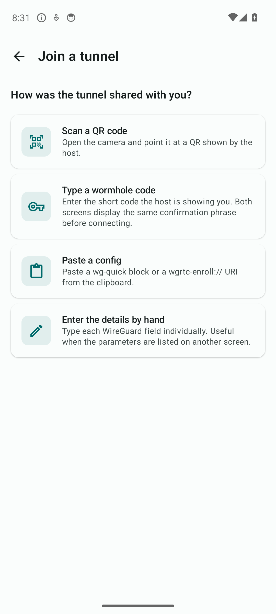
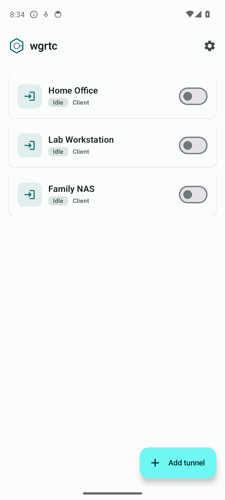
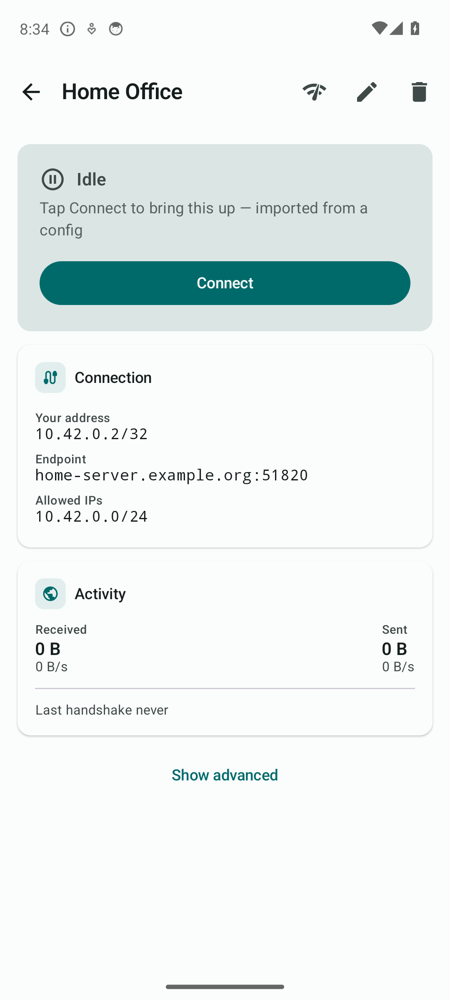
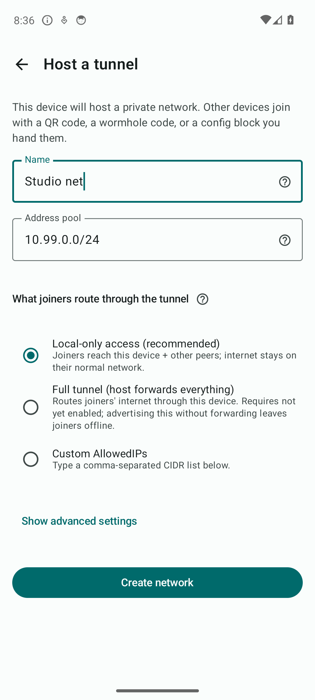
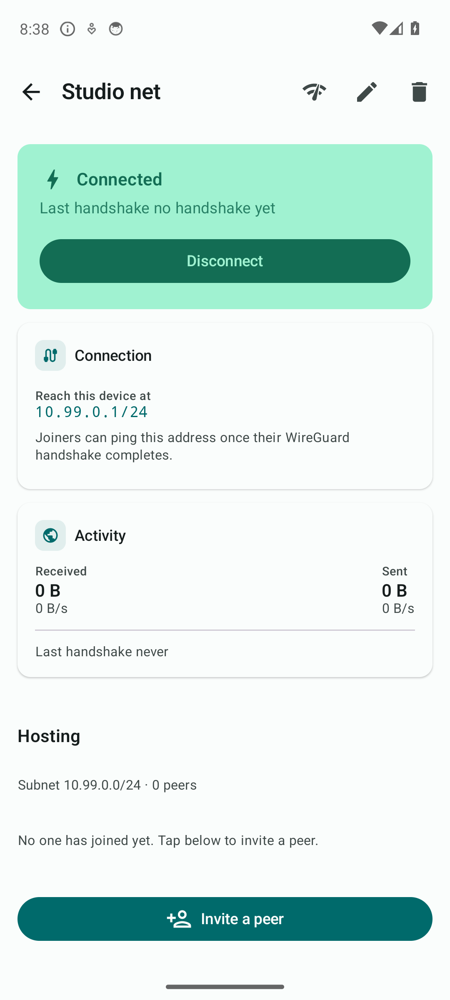
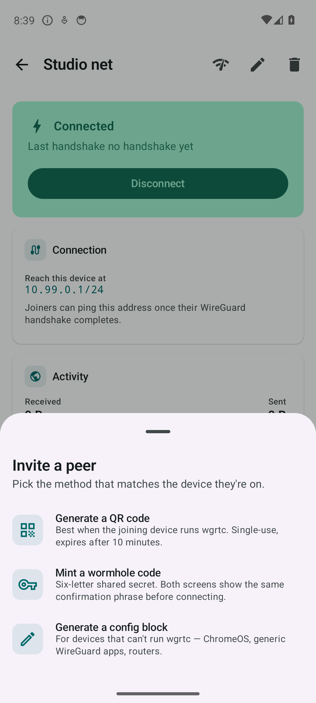
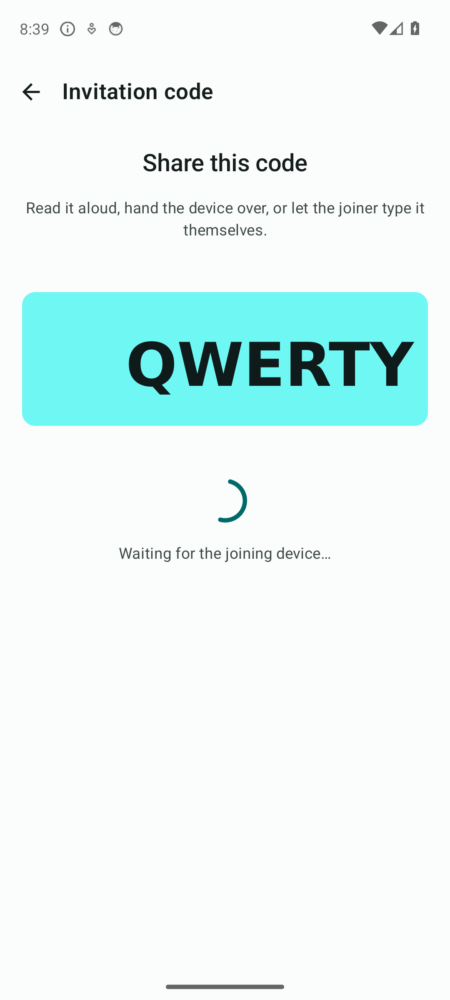
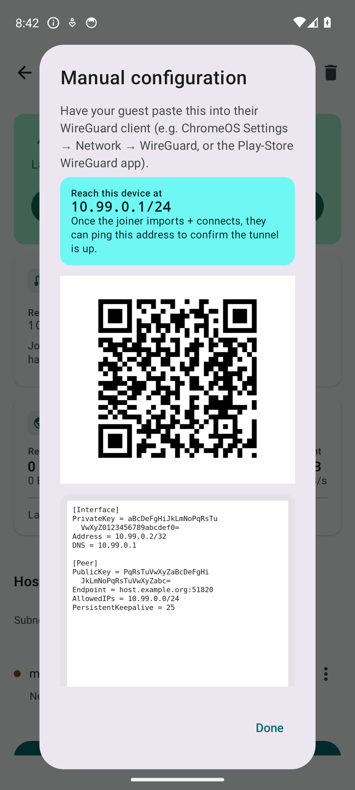

# wgrtc

**WireGuard tunnels that just work, even when both ends are behind NAT.**

You already know WireGuard is fast, modern, and audited.  What you might
not know is how irritating it is to *deploy*: somebody has to be on a
static, port-forwardable IP, or you end up paying for a relay.  Wgrtc
removes that requirement.  Two devices that have nothing in common but
internet access can discover each other, agree on their current public
endpoints, and bring up a direct WireGuard tunnel between them — no
central VPN provider, no port forward, no DDNS, no account.

It's the same protocol kernel WireGuard already speaks.  We don't fork
WireGuard, we don't replace it, we don't re-invent NAT traversal.  We
glue together pieces that already exist — WireGuard for the data plane,
a thin WebRTC-style signaling layer for endpoint discovery, raw-UDP
hole punching for NAT — and we package them so the result is a Debian
`.deb` on the Linux side and a signed `.apk` on the Android side.

---

## What this is good for

- **Reach your home network from anywhere.** Your router is behind
  carrier NAT; your ISP won't give you a port forward.  Run the daemon
  on a Linux box at home, install the Android app on your phone, and
  your phone routes through home from the coffee shop just like it does
  on your couch.

- **Bridge two NATed sites.**  You have two small offices, neither has
  a public IP, and you don't want a cloud relay charging you per
  gigabyte.  Run the daemon on a small box at each site; both daemons
  publish their current endpoint through the broker; a direct kernel
  WireGuard tunnel comes up between them.

- **Phone-to-phone, no servers.**  Two phones on different mobile
  carriers can join a tunnel hosted on one of them, with no involvement
  from any server you operate.  Use it for ad-hoc file sharing, remote
  desktop into a phone you left at home, or pair-programming over a
  shared subnet.  This gives you **reachability between the two
  devices**, not internet egress through the host — for "use my home
  network as my internet from the road", point your phone at a daemon
  running at home instead.

- **Tunnels you can trust on hostile hotspots.**  Hotel Wi-Fi captive
  portals don't care.  Coffee-shop DNS hijacking doesn't care.
  Long-lived WireGuard tunnels keep humming as the underlying network
  roams; wgrtc's signaling automatically follows.

## What you DON'T need

- **No port forwarding.**  The NAT discovers itself.
- **No DDNS.**  Endpoints update automatically as both sides roam.
- **No accounts.**  No login, no email, no telemetry, no central
  database of who's connected to whom.
- **No central VPN.**  Traffic goes peer-to-peer; we never see it.
  Even the signaling broker only ever sees ciphertext + opaque
  routing IDs.
- **No new protocol on the wire.**  It's still kernel WireGuard at
  both ends, the kind that's been audited and shipped in Linux since
  5.6.

---

## What's in this repo

| Component | Where | What it is |
|---|---|---|
| **Linux daemon** | [`daemon/`](daemon/) | Python 3 asyncio service that interrogates `wg show`, exchanges endpoint envelopes through a signaling broker, and punches NATs open with raw UDP.  Ships as a `.deb`. |
| **Android app**  | [`android/`](android/) | A WireGuard tunnel manager.  Joins tunnels hosted by daemons, joins tunnels hosted by other phones, or hosts a tunnel itself (full userspace WireGuard).  Distributed as a signed APK on this repository's [Releases](../../releases) page. |

### Use whichever side(s) you need

Both components speak the same encrypted-envelope wire format, so any side
of any tunnel can be either piece.  You don't have to pick one — you can
mix and match in whatever combination matches your environment:

| Host side | Joiner side | Typical scenario |
|---|---|---|
| **Daemon** on a Linux box at home | **App** on your phone | Reach your home LAN from anywhere on cellular or coffee-shop Wi-Fi. |
| **Daemon** on site A | **Daemon** on site B | Two NATed offices link up via a third-party broker; no cloud relay in the data path. |
| **App** on a phone with hotspot | **App** on a friend's phone | Ad-hoc tunnel for file sharing or pair-debugging when you happen to be on different mobile carriers. |
| **App** on a phone | **Daemon** on a server | Phone hosts; a Linux box at the lab joins to expose just one subnet to the phone for emergency remote-management. |
| **Daemon** | Plain `wg-quick`, no wgrtc | If one end has a stable public IP, that end doesn't need wgrtc at all — kernel WireGuard alone handles its side; wgrtc just maintains the moving side. |

You only need wgrtc on a side where the endpoint moves or sits behind NAT.
A box with a static IP and an open UDP port can run vanilla kernel WireGuard
with no wgrtc daemon — that still pairs cleanly with a phone or another
daemon doing wgrtc on the moving side.

---

## Setting up the daemon (one-time, per host)

Both walkthroughs that follow assume each Linux host running the daemon
has been through this setup once.  If you're doing site-to-site, run
through it on both boxes.  If you're hosting from a phone, you can skip
this entirely.

The first three steps are mandatory; step 4 only matters if you'll be
admitting peers via the QR-code flow (i.e. the phone-joining walkthrough
below).

1. **Install the daemon.**  Pre-built `.deb` from the
   [releases page](../../releases), or build with `dpkg-buildpackage`
   from [`daemon/`](daemon/).

2. **Generate a shared salt and put it in
   `/etc/wireguardrtc/wireguardrtc.conf`:**

   ```sh
   head -c 32 /dev/urandom | base64       # save this output
   sudo $EDITOR /etc/wireguardrtc/wireguardrtc.conf
   # [Global] Salt = <paste here>
   ```

   **The same salt value must appear on every host you want to talk to.**
   The daemon hashes its WireGuard public key with the salt to derive the
   ID it registers under on the broker, so two hosts with different salts
   never see each other.  This is the single most-forgotten step.

3. **Pick a signaling broker** in the same config file:

   - **Self-host the PeerJS broker** (recommended for anything
     beyond ad-hoc testing) — one Docker container:

     ```sh
     docker run -d --name peerjs-broker --restart=always \
         -p 9000:9000 peerjs/peerjs-server --port 9000 --key YOUR_SECRET_KEY
     ```

     Then set `[Global] PeerJsServer = ws://your.broker.example:9000/peerjs`
     and `PeerJsKey = YOUR_SECRET_KEY`.

   - **Or use the public broker** at `wss://0.peerjs.com/peerjs` with
     `PeerJsKey = peerjs` — fine for testing, please don't lean on
     somebody else's free infrastructure in production.

   See the [daemon's configuration checklist](daemon/README.md#configuration-checklist--every-place-you-have-to-touch)
   for the full list of settings, including the WireGuard-side
   prerequisites (fixed `ListenPort`, no `Endpoint =` on `[Peer]`
   entries).

4. **(Optional) Enable QR-based auto-enrollment.**  Skip this if you
   only need site-to-site between daemons you can already configure by
   hand.  Required if you want phones (or any device that scans
   `wgrtc-enroll://…` URIs) to join:

   ```ini
   [Enrollment]
   Enabled         = yes
   ProvisionScript = /usr/sbin/wireguardrtc-provision-client
   ```

   ```sh
   sudo systemctl enable --now wireguardrtc-provision-broker.socket
   sudo systemctl restart wireguardrtc
   ```

   Walk through [the daemon's auto-enrollment guide](daemon/README.md#auto-enrollment-optional)
   once for the pool / provisioner details; you don't repeat that per
   peer.

With this done on every daemon host in the mesh, pick the walkthrough
that matches what you're trying to do.

## Walkthrough: joining a tunnel from your phone

You have a Linux box running the daemon at home.  You want your phone
to route through it from anywhere.

**Prerequisites:** the [server setup above](#setting-up-the-daemon-one-time-per-host),
**including** the optional QR-auto-enrollment step (4).  Per-peer
provisioning then collapses to one CLI invocation: the daemon mints
a single-use QR, the phone scans it, the phone generates its own
keypair on-device, and the daemon writes the matching peer entry
under `/var/lib/wireguardrtc/auto-enrolled.d/` for you.  No copy-paste
of base64 keys.

1. **Mint a one-time invitation** on the server:

   ```sh
   sudo wireguardrtc --enroll-token "phone" --expires 600
   ```

   A `wgrtc-enroll://…` URI prints, plus a QR code in the terminal if
   stdout is a TTY.  The QR is single-use and expires in 10 minutes.

2. **On the phone**, open wgrtc and tap **Add tunnel → Join a tunnel**:

   <p align="center"></p>

   - **Scan a QR code** — point the phone at the terminal showing
     the QR.  Done.
   - **Paste a config** — if you SSH'd in from elsewhere and only
     have the `wgrtc-enroll://…` text, paste it into the phone here.
   - **Type a wormhole code** — works phone-to-phone and, since
     v0.2.4, also phone-to-daemon and daemon-to-daemon.  Mint with
     `sudo wireguardrtc --mint-wormhole --iface wg0` on the server,
     type the 6-letter code on the joiner (`sudo wireguardrtc
     --use-wormhole ABCDEF` on a Linux client, or the app's wormhole
     input on a phone), confirm the 4-word SAS phrase matches on
     both sides.

3. **The tunnel appears in the list, idle.**  Tap to bring it up:

   <p align="center"></p>

4. **Tap a tunnel** to see its address, endpoint, and live activity:

   <p align="center"></p>

Your phone now routes the home subnet's traffic over WireGuard
peer-to-peer to the home box.  No port forward on your home router
was needed.  No cloud VPN saw your data.

> **Manual alternative** for admins who already manage `wg-quick` by
> hand and have the phone's public key in advance: skip step (4) of
> the daemon setup, write a `/etc/wireguardrtc/peers.d/myphone.conf`
> drop-in with `PublicKey = …` and `Mode = active`, then generate a
> `wg-quick` config block for the phone to import via **Paste a
> config** or **Enter by hand**.  You bring your own delivery
> channel; the daemon never sees a QR.

## Walkthrough: site-to-site (two daemons)

Two Linux boxes, each on its own NATed network, paired into a single
WireGuard mesh.  No public IP on either side.

**Prerequisites:** the [server setup above](#setting-up-the-daemon-one-time-per-host)
on **both** hosts, with the **same** `Salt` value in
`wireguardrtc.conf` on each.  The optional QR-auto-enrollment step (4)
is not required — for daemon-to-daemon today you'll exchange keys by
hand.

1. **Exchange the two hosts' WireGuard public keys.**  On each:

   ```sh
   sudo wg show wg0 public-key
   ```

   `scp` / paste / read aloud — whatever your trusted channel is.
   (Task D1 will replace this step with a six-letter wormhole code
   so two daemons can pair the same way two phones already can; see
   the [daemon roadmap](daemon/README.md#roadmap-wormhole-pairing).)

2. **On each host, add a `peers.d/<label>.conf` drop-in** declaring
   the other side's pubkey:

   ```ini
   [Peer]
   PublicKey = <the OTHER host's WG public key>
   Mode      = active
   ```

3. **Start the daemon on both sides**:

   ```sh
   sudo systemctl enable --now wireguardrtc
   ```

   Tunnel comes up within a few seconds; `wg show wg0 latest-handshakes`
   on either host shows a fresh timestamp.

## Walkthrough: hosting a tunnel from your phone

Same app, the other direction.  Useful for pulling files off a phone
you left somewhere, or pairing two phones on different carriers.

1. **Add tunnel → Host a tunnel.** Pick a name and accept the
   defaults — the WireGuard subnet defaults to `10.99.0.0/24`, and
   joiners by default only route the tunnel's own subnet through the
   tunnel (so their internet keeps working as normal).

   <p align="center"></p>

2. **Tap Connect.**  The phone brings its userspace WireGuard endpoint
   up — no root needed.  You'll see a "Hosting" section telling you no
   one has joined yet.

   <p align="center"></p>

3. **Tap Invite a peer.**  Pick how to deliver the invitation,
   depending on whether your guest is on the same device class as you:

   <p align="center"></p>

   - **Generate a QR code** — single-use, expires in 10 minutes.  Best
     when your guest is on a phone with the wgrtc app installed.
   - **Mint a wormhole code** — a six-letter shared secret you read
     aloud over a phone call.  Both screens show the same confirmation
     phrase before completing the connection; an attacker who guesses
     the wormhole code still can't impersonate you.

     <p align="center"></p>

   - **Generate a config block** — for ChromeOS, generic WireGuard apps,
     and routers.  Includes a QR for clients that scan, plus the raw
     `[Interface]…[Peer]…` for clients that don't:

     <p align="center"></p>

Wgrtc handles the rest: discovering both sides' current public
endpoints, punching the NATs open, watching for endpoint changes as the
phone roams between Wi-Fi and mobile.

---

## How it actually works

The cryptographic and protocol details are in
[`docs/wg-holepunch-guide.md`](docs/wg-holepunch-guide.md).  The short
version:

1. **Signaling.**  Both peers connect to a WebSocket broker (self-host
   is recommended; the public `0.peerjs.com` also works for ad-hoc
   testing).  Each peer derives a routing ID by hashing its own
   WireGuard public key with a shared salt.  The broker matches them
   up, but never sees plaintext.
2. **Endpoint envelope.**  The active peer encrypts its current public
   endpoint (discovered through STUN) with a key derived from
   `X25519(my_wg_priv, peer_wg_pub)` plus a domain-separating label.
   The receiver decrypts, checks a freshness timestamp, and learns
   where to reach the sender.
3. **NAT punch.**  Each side spoofs the source port of a raw UDP packet
   from its WireGuard listen port to the other side's discovered
   endpoint.  This creates two-way NAT state without sending anything
   the other side's kernel WireGuard module will reject.
4. **Handshake.**  A normal WireGuard handshake completes through both
   newly-opened NAT states.  From here on it's plain kernel WireGuard,
   running at line rate.

## NAT compatibility

| Your NAT type | Result |
|---|---|
| Full-cone / address-restricted / port-restricted, **port-preserving** | Works |
| Cone NAT, **non-port-preserving** (rare; mostly enterprise) | Fails — needs UPnP, NAT-PMP/PCP, or a manual port forward |
| **Symmetric** NAT on at least one side | Out of reach: hole-punching can't predict the port the NAT will rewrite to |
| Behind two NATs (CGNAT + home NAT) | Works as long as the outer NAT is cone — most consumer CGNAT is |

This matches what's possible for any peer-to-peer protocol over UDP.
WebRTC, BitTorrent, and Tailscale's "DERP-less" path all hit the same
symmetric-NAT wall.  Wgrtc is direct-path only; if both ends sit
behind symmetric NATs you'll need a relay solution outside this
project's scope.

**Check your network before you set anything up.**  Both surfaces
expose a no-installation NAT probe that runs **IPv4 and IPv6
independently** — they're often routed differently, and IPv6
frequently has no NAT at all even when your IPv4 path is behind
CGNAT:

- Linux daemon: `wireguardrtc --check-nat` prints a verdict for each
  available family and exits.  No root needed; sends a handful of
  small UDP packets to three public STUN servers.  Restrict with
  `--family 4` or `--family 6` if you want a single family.
- Android app: Settings → *Network check* → *Run NAT test*.  Same
  three-server probe per family; shows local address, external
  address, and verdict side-by-side.

---

## Install

### Linux daemon (Debian / Ubuntu)

Pre-built `.deb` packages ship on the [GitHub releases
page](../../releases).  Or build from source:

```sh
cd daemon
dpkg-buildpackage -us -uc -b
sudo dpkg -i ../wireguardrtc_*_all.deb
```

Then read [`daemon/README.md`](daemon/README.md) for the per-peer
config-file format.

### Android

The app is distributed as a signed APK from this repository's
[Releases](../../releases) page — it isn't on the Play Store.  Two
ways to install:

- **Pre-built APK.**  Download the `.apk` for your CPU architecture
  (most phones: `arm64-v8a`), enable "Install unknown apps" for your
  browser or file manager, and open it.
- **Build from source:**

  ```sh
  cd android
  ( cd wgbridge_native && ./build.sh )
  ./gradlew :app:assembleRelease
  ```

  See [`android/README.md`](android/README.md) for the build
  prerequisites (NDK, Go).

For auto-update on sideloaded installs, point
[Obtainium](https://obtainium.imranr.dev/) at this repository's
Releases page — it polls for new tags and installs them like a
miniature personal app store.

---

## Privacy

The privacy policy in [`PRIVACY.md`](PRIVACY.md) is the authoritative
statement.  In short: we don't have servers, we don't have accounts,
the broker only ever sees opaque ciphertext.

## License

Apache License 2.0 — see [`LICENSE`](LICENSE).

Third-party components retain their own licenses; see
[`NOTICE`](NOTICE) and [`THIRD_PARTY_LICENSES/`](THIRD_PARTY_LICENSES/).

WireGuard is a registered trademark of Jason A. Donenfeld.

---

## Contributing & releasing

- Bugs, feature requests: please open a GitHub issue.
- Code contributions: [`CONTRIBUTING.md`](CONTRIBUTING.md).
- Cutting a release: [`RELEASING.md`](RELEASING.md).
